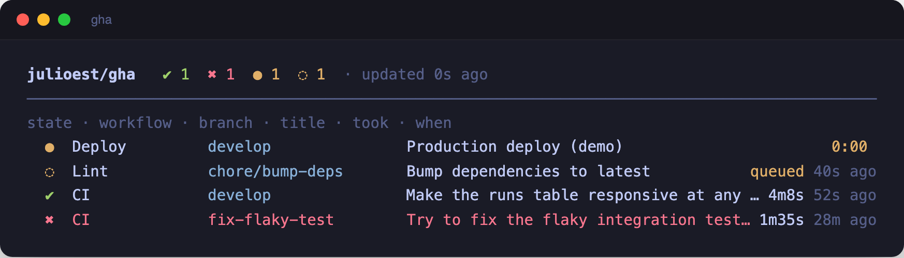
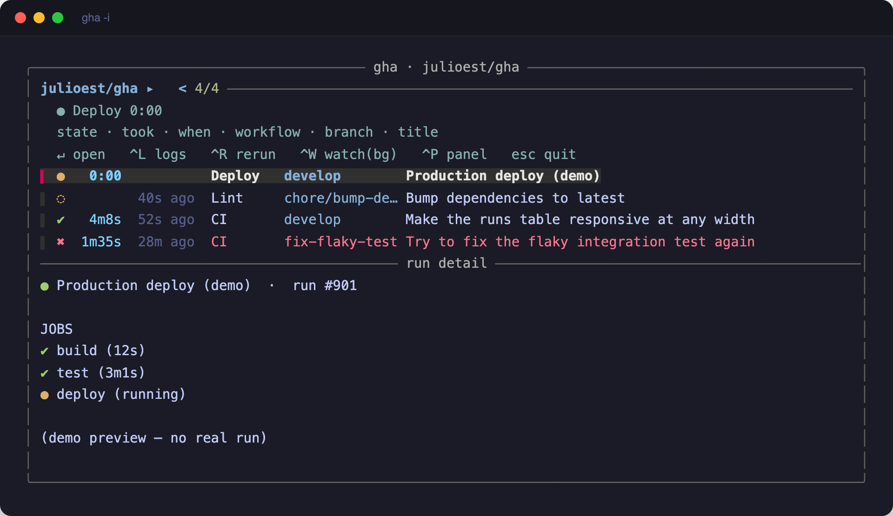
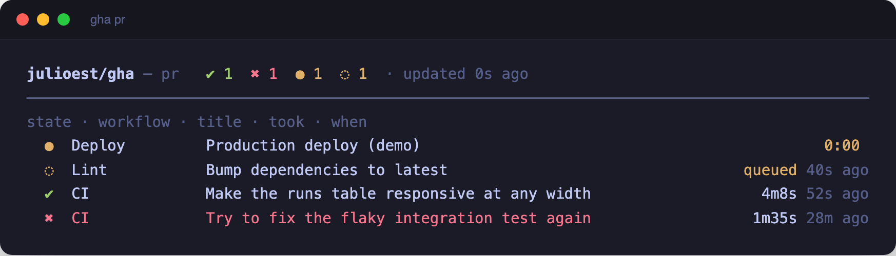
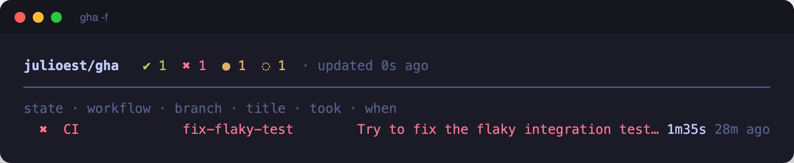

# gha

Fast GitHub Actions status for the current repo, right from your terminal.

Mirrors the repo's Actions page — latest runs across **all** branches by default —
with live-ticking timers, an interactive `fzf` picker, and desktop notifications
when a run finishes. Runs on **macOS and Linux**.



## Usage

```
gha            latest runs across ALL branches (the Actions page)
gha -i         interactive picker (fzf): preview jobs, open, logs, rerun
gha -L         live view: timers tick every $GHA_INTERVAL (1s) from cache;
               network refresh every $GHA_POLL (6s) in the background
gha pr         checks for the current branch's open PR
gha -b         only the CURRENT git branch
gha <branch>   only a specific branch
gha -f         only failed/cancelled runs
gha -n N       show N runs (default 15)
gha -w         watch newest run live in the FOREGROUND (blocks)
gha -N         watch newest run in the BACKGROUND + notify on finish
gha --web      open the Actions page in a browser
gha --demo     preview the UX with synthetic data (try: gha --demo -L, -i -L)
```

Repo resolution: `$GHA_REPO`, else the `upstream`/`origin` remote of the current
repo, else whatever `gh` resolves for the directory.

## Screens

`gha -i` opens an `fzf` picker. The preview pane shows the selected run's jobs,
and the footer keys open it on GitHub, tail logs, rerun, or watch in the background.



`gha pr` narrows to the checks on the current branch's open PR.



`gha -f` shows only what broke.



## Requirements

- [`gh`](https://cli.github.com) (authenticated) and [`jq`](https://jqlang.github.io/jq/)
- `bash` 3.2+ (the stock macOS `/bin/bash` is fine)
- `fzf` and `curl` — for interactive mode (`-i`)
- **Linux only:** `xdg-utils` (for `--web`) and `libnotify`/`notify-send` (for `-N` banners).
  Both degrade gracefully if absent.

## Install

Clone anywhere, then symlink the script onto your `PATH`:

```sh
git clone https://github.com/julioest/gha.git ~/dev/gha
ln -s ~/dev/gha/gha ~/.local/bin/gha   # or any dir on your PATH
```

`~/.local/bin` is not on `PATH` by default on macOS. Either add it
(`export PATH="$HOME/.local/bin:$PATH"` in your shell profile) or symlink
into a directory that already is, such as `/usr/local/bin`.

## Quick check

No network or `gh` needed — `--demo` renders synthetic runs:

```sh
gha --demo -n 4      # static table
gha --demo -L        # live, ticking timers
gha --demo -i -L     # interactive picker, live
```

## License

MIT. See [LICENSE](LICENSE).
